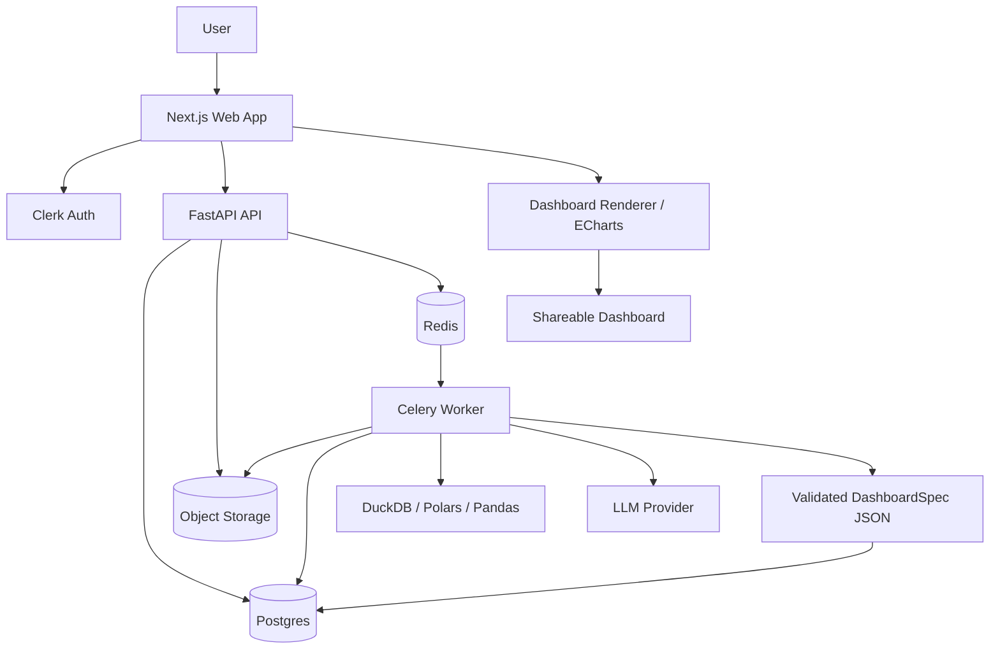
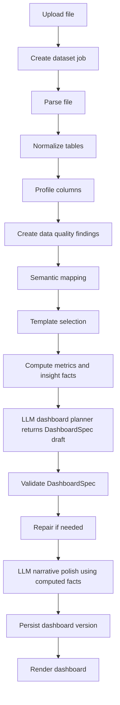

# Picxify — Ground-Up Architecture and Implementation Guide

**Product:** Picxify  
**Positioning:** Drop in messy data. Get the story.  
**Mission statement:** Picxify lets you turn any data point into a visual dashboard.  
**Primary wedge:** Client-ready, shareable dashboards for consultants, agencies, founders, marketers, operators, and small teams.  
**Document purpose:** Give Codex, Claude Code, or an engineering team enough detail to build Picxify from step 0 through MVP and into a paid v1.

---

## 0. Executive Summary

Picxify should not be “a chatbot that makes charts.” ChatGPT, Claude, and similar tools can already analyze files, generate charts, and create simple interactive artifacts when prompted well. Picxify wins by packaging that capability into a finished business workflow:

> Upload messy business data → Picxify cleans/profiles it → detects the likely story → generates a beautiful dashboard → explains assumptions → validates insights → produces a shareable link/export → supports recurring refresh.

The winning product outcome is not a chart. The winning outcome is a polished, trustworthy, client/investor/team-ready visual deliverable.

### MVP promise

For v1, keep the promise narrow and believable:

> Upload a CSV, Excel file, Google Sheet, or pasted table/text. Picxify turns it into a polished dashboard with KPIs, charts, insights, source traces, editable assumptions, and a shareable link.

### Non-MVP promise to avoid

Do **not** promise this in the first release:

> Upload literally anything and Picxify always understands it perfectly.

That future is possible only after a strong ingestion, extraction, trust, and evaluation layer exists.

---

## 1. Product Strategy

### 1.1 Ideal customer profile

Start with users who repeatedly turn messy data into reports for someone else:

1. **Marketing agencies** generating client campaign reports.
2. **Consultants/fractional operators** turning spreadsheets, surveys, or client exports into executive reports.
3. **Founders** creating investor updates from sales, marketing, usage, and finance data.
4. **Operators/RevOps teams** creating weekly KPI reviews.
5. **Customer success teams** turning feedback/account data into risk and opportunity dashboards.

The initial wedge should be **Picxify for client-ready reports**.

### 1.2 Differentiator vs GPT/Claude

General chatbots are flexible, but they require prompting, iteration, verification, design cleanup, hosting, and sharing. Picxify should be opinionated and workflow-native.

| User need | GPT/Claude | Picxify requirement |
|---|---|---|
| Upload messy data | Possible | Default starting point |
| Clean and profile data | User has to ask/verify | Automatic, visible, editable |
| Pick dashboard structure | Prompt-dependent | Template-first selection |
| Calculate metrics | Possible but must verify | Deterministic code only |
| Write narrative insights | Strong | Strong, but grounded in computed facts |
| Show assumptions | User has to ask | Always visible |
| Verify source of chart/insight | Manual | Every widget has `sourceTrace` |
| Make it beautiful | Variable | Product-level design system |
| Share with client/team | Often manual | One-click hosted link/export |
| Refresh next period | Manual | Recurring workflow |
| Team/client workspace | Not native | Native |

### 1.3 Core product principles

1. **No-prompt magic:** The default path should work without users needing to craft prompts.
2. **Code calculates. AI narrates/plans:** Never rely on AI alone for numerical facts.
3. **Template-first dashboards:** The AI selects and fills approved dashboard templates.
4. **Trust is a feature:** Assumptions, data cleaning decisions, formula traces, and confidence must be visible.
5. **Shareability drives growth:** Viewers should be free; creators/editors pay.
6. **Audience-aware output:** The same dataset can become an executive, client, investor, analyst, or team dashboard.
7. **Recurring reports create retention:** Weekly/monthly refresh is more valuable than one-off chart generation.

---

## 2. MVP Scope

### 2.1 Inputs supported in MVP

MVP input types:

- CSV
- XLSX/XLS
- Pasted table text
- Pasted unstructured text, especially survey/customer feedback notes
- Google Sheets link or import, if time permits

Post-MVP input types:

- PDFs
- Google Docs
- PowerPoint/deck files
- Screenshots/images
- Multi-file joins
- Direct app connectors like HubSpot, Stripe, GA4, Salesforce, Shopify

### 2.2 Outputs supported in MVP

Required outputs:

- Interactive dashboard page
- KPI cards
- Chart sections
- Insight cards
- Executive summary
- Assumption panel
- Source trace panel for every insight/chart/KPI
- Shareable private/public link
- PDF export or print-optimized page

Nice-to-have MVP outputs:

- PNG export for individual charts
- “Client view” and “Analyst view” toggle
- Brand theme picker
- Dashboard comments

### 2.3 Initial dashboard templates

Build these templates first:

1. **Client Report** — strongest wedge; polished narrative plus charts.
2. **Marketing Performance** — campaign/channel/date/spend/conversions/CAC/ROAS.
3. **Sales Pipeline** — pipeline stages, won/lost, revenue, forecast, segment.
4. **Survey Results** — rating distributions, NPS-style metrics, themes, representative comments.
5. **Customer Feedback** — sentiment, themes, friction points, opportunities.
6. **Generic Executive Snapshot** — fallback template for unknown datasets.

Post-MVP templates:

- Finance/cash flow
- Operations/KPI review
- Investor update
- Real estate portfolio
- E-commerce performance
- Product analytics

### 2.4 MVP anti-goals

Do not start with:

- Full enterprise BI replacement
- Complex semantic modeling layer
- Direct warehouse connectors
- Real-time dashboards
- Advanced permission matrix beyond workspace roles
- Perfect PDF extraction
- Natural-language “ask anything” as the main experience
- Dozens of chart types before the first 6 templates are excellent

---

## 3. Recommended Stack

This stack optimizes for fast MVP development while preserving a path to serious SaaS reliability.

### 3.1 Frontend

- **Next.js App Router** with TypeScript
- Tailwind CSS
- shadcn/ui or equivalent component primitives
- ECharts for interactive dashboards
- TanStack Query for API state
- Zustand or React context for lightweight local dashboard editing state
- React Hook Form + Zod for forms and validation

Why: Next.js App Router gives a modern React app structure with server/client components, layouts, route handlers, and good deployment options. ECharts gives rich browser-side charts and many chart types.

### 3.2 Backend/API

- **FastAPI** for API service
- Pydantic for request/response validation
- SQLAlchemy 2.x + Alembic for database models/migrations
- Celery for asynchronous jobs
- Redis as broker/cache
- OpenAPI docs enabled in dev

Why: Python is the best fit for parsing, profiling, statistics, and AI/data orchestration.

### 3.3 Data processing

- DuckDB for CSV sniffing, local analytics, and SQL over files
- Polars or pandas for DataFrame transformations
- openpyxl or calamine-compatible Excel parser for spreadsheet extraction
- PyArrow/Parquet for dataset snapshots
- Optional later: Great Expectations or custom validation suite

Core rule:

> The AI never receives raw massive files. Code profiles/summarizes data, then the AI receives compact schemas, stats, samples, and computed facts.

### 3.4 AI layer

- OpenAI API or equivalent model provider
- Structured Outputs / JSON-schema-constrained generation for dashboard planning
- Function/tool calling for controlled calculations and validation
- Separate model calls for:
  - semantic mapping
  - dashboard planning
  - narrative generation
  - text field theme/sentiment extraction

### 3.5 Database/storage/infra

Local dev:

- Docker Compose Postgres
- Docker Compose Redis
- Docker Compose MinIO for S3-compatible storage

Production MVP:

- Web: Vercel
- API/worker: Fly.io, Render, Railway, AWS ECS, or Google Cloud Run
- Database: Supabase Postgres, Neon, RDS, or Cloud SQL
- Object storage: Cloudflare R2, AWS S3, Supabase Storage, or GCS
- Redis: Upstash, Redis Cloud, or managed Redis
- Auth: Clerk recommended for fastest org/workspace UX; Supabase Auth is acceptable if you prefer one backend platform
- Billing: Stripe Billing + Checkout + customer portal
- Observability: Sentry + OpenTelemetry logs/traces + PostHog/Product analytics

---

## 4. High-Level Architecture



### 4.1 Core services

1. **Web app**
   - Landing page
   - Auth/workspace onboarding
   - Upload flow
   - Job progress UI
   - Dashboard renderer
   - Assumption editor
   - Share/export
   - Billing/account settings

2. **API service**
   - Auth verification
   - Workspace and dashboard CRUD
   - Presigned upload URLs
   - Job creation and status
   - Billing webhooks
   - Share permissions

3. **Worker service**
   - File parsing
   - Data profiling
   - Semantic mapping
   - Insight computation
   - AI planning/narrative
   - DashboardSpec validation
   - Export generation
   - Scheduled refreshes

4. **Database**
   - Users/workspaces
   - Dataset metadata
   - Data quality findings
   - Dashboard versions/specs
   - Usage ledger
   - Billing/subscriptions
   - Audit events

5. **Object storage**
   - Raw uploads
   - Cleaned dataset snapshots
   - Parquet files
   - Exported PDFs/images
   - Optional static dashboard bundles

---

## 5. Repository Structure

Use a monorepo so an agent can reason across the full product.

```txt
picxify/
  README.md
  SETUP.md
  docker-compose.yml
  .env.example
  .gitignore

  apps/
    web/
      app/
        (marketing)/
          page.tsx
          pricing/page.tsx
        (app)/
          dashboard/page.tsx
          upload/page.tsx
          dashboards/[dashboardId]/page.tsx
          dashboards/[dashboardId]/edit/page.tsx
          settings/page.tsx
        share/[slug]/page.tsx
        api/health/route.ts
      components/
        brand/
        upload/
        dashboard/
        charts/
        assumptions/
        billing/
      lib/
        api-client.ts
        auth.ts
        dashboard-spec.ts
        format.ts
      package.json
      next.config.ts
      tailwind.config.ts
      tsconfig.json

    api/
      app/
        main.py
        config.py
        db.py
        auth.py
        models/
        schemas/
        routers/
          health.py
          uploads.py
          datasets.py
          dashboards.py
          jobs.py
          billing.py
          shares.py
        services/
          storage.py
          billing.py
          usage.py
          permissions.py
        workers/
          celery_app.py
          tasks.py
        migrations/
      tests/
      pyproject.toml
      alembic.ini

  packages/
    schemas/
      dashboard_spec.schema.json
    sample-data/
      sales_pipeline.csv
      marketing_campaigns.csv
      survey_results.csv
      customer_feedback.csv

  docs/
    product/
      positioning.md
      pricing.md
      user-flows.md
    engineering/
      api-contract.md
      evals.md
      security.md
```

---

## 6. Database Schema

This is an MVP-friendly relational schema. Use JSONB where the product benefits from flexible versioning, especially for generated dashboard specs and profiling output.

### 6.1 SQL schema draft

```sql
-- Enable useful extensions when available.
CREATE EXTENSION IF NOT EXISTS pgcrypto;

CREATE TYPE workspace_role AS ENUM ('owner', 'admin', 'editor', 'viewer');
CREATE TYPE job_status AS ENUM ('queued', 'running', 'succeeded', 'failed', 'cancelled');
CREATE TYPE file_status AS ENUM ('uploaded', 'parsed', 'failed', 'deleted');
CREATE TYPE dashboard_visibility AS ENUM ('private', 'unlisted', 'public');
CREATE TYPE plan_code AS ENUM ('free', 'creator', 'team', 'business');

CREATE TABLE users (
  id UUID PRIMARY KEY DEFAULT gen_random_uuid(),
  auth_provider TEXT NOT NULL DEFAULT 'clerk',
  auth_user_id TEXT NOT NULL UNIQUE,
  email TEXT NOT NULL,
  name TEXT,
  avatar_url TEXT,
  created_at TIMESTAMPTZ NOT NULL DEFAULT now(),
  updated_at TIMESTAMPTZ NOT NULL DEFAULT now()
);

CREATE TABLE workspaces (
  id UUID PRIMARY KEY DEFAULT gen_random_uuid(),
  name TEXT NOT NULL,
  slug TEXT UNIQUE,
  default_brand_kit JSONB NOT NULL DEFAULT '{}'::jsonb,
  created_by UUID NOT NULL REFERENCES users(id),
  created_at TIMESTAMPTZ NOT NULL DEFAULT now(),
  updated_at TIMESTAMPTZ NOT NULL DEFAULT now()
);

CREATE TABLE memberships (
  id UUID PRIMARY KEY DEFAULT gen_random_uuid(),
  workspace_id UUID NOT NULL REFERENCES workspaces(id) ON DELETE CASCADE,
  user_id UUID NOT NULL REFERENCES users(id) ON DELETE CASCADE,
  role workspace_role NOT NULL DEFAULT 'editor',
  created_at TIMESTAMPTZ NOT NULL DEFAULT now(),
  UNIQUE(workspace_id, user_id)
);

CREATE TABLE subscriptions (
  id UUID PRIMARY KEY DEFAULT gen_random_uuid(),
  workspace_id UUID NOT NULL REFERENCES workspaces(id) ON DELETE CASCADE,
  plan plan_code NOT NULL DEFAULT 'free',
  stripe_customer_id TEXT,
  stripe_subscription_id TEXT,
  status TEXT NOT NULL DEFAULT 'active',
  current_period_start TIMESTAMPTZ,
  current_period_end TIMESTAMPTZ,
  created_at TIMESTAMPTZ NOT NULL DEFAULT now(),
  updated_at TIMESTAMPTZ NOT NULL DEFAULT now()
);

CREATE TABLE usage_ledger (
  id UUID PRIMARY KEY DEFAULT gen_random_uuid(),
  workspace_id UUID NOT NULL REFERENCES workspaces(id) ON DELETE CASCADE,
  user_id UUID REFERENCES users(id),
  event_type TEXT NOT NULL,
  credits_delta INTEGER NOT NULL,
  metadata JSONB NOT NULL DEFAULT '{}'::jsonb,
  created_at TIMESTAMPTZ NOT NULL DEFAULT now()
);

CREATE TABLE uploaded_files (
  id UUID PRIMARY KEY DEFAULT gen_random_uuid(),
  workspace_id UUID NOT NULL REFERENCES workspaces(id) ON DELETE CASCADE,
  uploaded_by UUID NOT NULL REFERENCES users(id),
  original_filename TEXT NOT NULL,
  mime_type TEXT,
  size_bytes BIGINT NOT NULL,
  object_key TEXT NOT NULL,
  checksum_sha256 TEXT,
  status file_status NOT NULL DEFAULT 'uploaded',
  created_at TIMESTAMPTZ NOT NULL DEFAULT now(),
  deleted_at TIMESTAMPTZ
);

CREATE TABLE datasets (
  id UUID PRIMARY KEY DEFAULT gen_random_uuid(),
  workspace_id UUID NOT NULL REFERENCES workspaces(id) ON DELETE CASCADE,
  file_id UUID REFERENCES uploaded_files(id),
  name TEXT NOT NULL,
  source_type TEXT NOT NULL,
  profile JSONB NOT NULL DEFAULT '{}'::jsonb,
  quality_score NUMERIC(5,4),
  snapshot_object_key TEXT,
  row_count BIGINT,
  table_count INTEGER DEFAULT 1,
  created_by UUID NOT NULL REFERENCES users(id),
  created_at TIMESTAMPTZ NOT NULL DEFAULT now(),
  updated_at TIMESTAMPTZ NOT NULL DEFAULT now()
);

CREATE TABLE dataset_tables (
  id UUID PRIMARY KEY DEFAULT gen_random_uuid(),
  dataset_id UUID NOT NULL REFERENCES datasets(id) ON DELETE CASCADE,
  name TEXT NOT NULL,
  normalized_name TEXT NOT NULL,
  row_count BIGINT NOT NULL DEFAULT 0,
  column_count INTEGER NOT NULL DEFAULT 0,
  profile JSONB NOT NULL DEFAULT '{}'::jsonb,
  sample_rows JSONB NOT NULL DEFAULT '[]'::jsonb,
  created_at TIMESTAMPTZ NOT NULL DEFAULT now()
);

CREATE TABLE dataset_columns (
  id UUID PRIMARY KEY DEFAULT gen_random_uuid(),
  table_id UUID NOT NULL REFERENCES dataset_tables(id) ON DELETE CASCADE,
  name TEXT NOT NULL,
  normalized_name TEXT NOT NULL,
  detected_type TEXT NOT NULL,
  semantic_type TEXT,
  role_hint TEXT,
  nullable_ratio NUMERIC(5,4),
  unique_ratio NUMERIC(5,4),
  stats JSONB NOT NULL DEFAULT '{}'::jsonb,
  examples JSONB NOT NULL DEFAULT '[]'::jsonb,
  confidence NUMERIC(5,4),
  created_at TIMESTAMPTZ NOT NULL DEFAULT now()
);

CREATE TABLE data_quality_findings (
  id UUID PRIMARY KEY DEFAULT gen_random_uuid(),
  dataset_id UUID NOT NULL REFERENCES datasets(id) ON DELETE CASCADE,
  table_id UUID REFERENCES dataset_tables(id) ON DELETE CASCADE,
  column_id UUID REFERENCES dataset_columns(id) ON DELETE SET NULL,
  severity TEXT NOT NULL,
  finding_type TEXT NOT NULL,
  message TEXT NOT NULL,
  metadata JSONB NOT NULL DEFAULT '{}'::jsonb,
  created_at TIMESTAMPTZ NOT NULL DEFAULT now()
);

CREATE TABLE dashboard_templates (
  id UUID PRIMARY KEY DEFAULT gen_random_uuid(),
  code TEXT NOT NULL UNIQUE,
  name TEXT NOT NULL,
  use_case TEXT NOT NULL,
  audience TEXT NOT NULL,
  definition JSONB NOT NULL,
  is_active BOOLEAN NOT NULL DEFAULT TRUE,
  created_at TIMESTAMPTZ NOT NULL DEFAULT now(),
  updated_at TIMESTAMPTZ NOT NULL DEFAULT now()
);

CREATE TABLE dashboards (
  id UUID PRIMARY KEY DEFAULT gen_random_uuid(),
  workspace_id UUID NOT NULL REFERENCES workspaces(id) ON DELETE CASCADE,
  dataset_id UUID REFERENCES datasets(id) ON DELETE SET NULL,
  template_id UUID REFERENCES dashboard_templates(id),
  title TEXT NOT NULL,
  subtitle TEXT,
  visibility dashboard_visibility NOT NULL DEFAULT 'private',
  share_slug TEXT UNIQUE,
  current_version_id UUID,
  created_by UUID NOT NULL REFERENCES users(id),
  created_at TIMESTAMPTZ NOT NULL DEFAULT now(),
  updated_at TIMESTAMPTZ NOT NULL DEFAULT now(),
  deleted_at TIMESTAMPTZ
);

CREATE TABLE dashboard_versions (
  id UUID PRIMARY KEY DEFAULT gen_random_uuid(),
  dashboard_id UUID NOT NULL REFERENCES dashboards(id) ON DELETE CASCADE,
  version_number INTEGER NOT NULL,
  spec JSONB NOT NULL,
  generation_metadata JSONB NOT NULL DEFAULT '{}'::jsonb,
  created_by UUID REFERENCES users(id),
  created_at TIMESTAMPTZ NOT NULL DEFAULT now(),
  UNIQUE(dashboard_id, version_number)
);

ALTER TABLE dashboards
  ADD CONSTRAINT fk_dashboards_current_version
  FOREIGN KEY (current_version_id) REFERENCES dashboard_versions(id);

CREATE TABLE assumptions (
  id UUID PRIMARY KEY DEFAULT gen_random_uuid(),
  dashboard_version_id UUID NOT NULL REFERENCES dashboard_versions(id) ON DELETE CASCADE,
  label TEXT NOT NULL,
  status TEXT NOT NULL,
  confidence NUMERIC(5,4),
  editable BOOLEAN NOT NULL DEFAULT TRUE,
  source TEXT NOT NULL,
  metadata JSONB NOT NULL DEFAULT '{}'::jsonb,
  created_at TIMESTAMPTZ NOT NULL DEFAULT now()
);

CREATE TABLE generation_jobs (
  id UUID PRIMARY KEY DEFAULT gen_random_uuid(),
  workspace_id UUID NOT NULL REFERENCES workspaces(id) ON DELETE CASCADE,
  user_id UUID NOT NULL REFERENCES users(id),
  dataset_id UUID REFERENCES datasets(id),
  dashboard_id UUID REFERENCES dashboards(id),
  job_type TEXT NOT NULL,
  status job_status NOT NULL DEFAULT 'queued',
  progress INTEGER NOT NULL DEFAULT 0,
  current_step TEXT,
  error_message TEXT,
  input JSONB NOT NULL DEFAULT '{}'::jsonb,
  output JSONB NOT NULL DEFAULT '{}'::jsonb,
  started_at TIMESTAMPTZ,
  finished_at TIMESTAMPTZ,
  created_at TIMESTAMPTZ NOT NULL DEFAULT now(),
  updated_at TIMESTAMPTZ NOT NULL DEFAULT now()
);

CREATE TABLE dashboard_comments (
  id UUID PRIMARY KEY DEFAULT gen_random_uuid(),
  dashboard_id UUID NOT NULL REFERENCES dashboards(id) ON DELETE CASCADE,
  user_id UUID NOT NULL REFERENCES users(id),
  widget_id TEXT,
  body TEXT NOT NULL,
  created_at TIMESTAMPTZ NOT NULL DEFAULT now(),
  deleted_at TIMESTAMPTZ
);

CREATE TABLE refresh_schedules (
  id UUID PRIMARY KEY DEFAULT gen_random_uuid(),
  dashboard_id UUID NOT NULL REFERENCES dashboards(id) ON DELETE CASCADE,
  cron_expression TEXT NOT NULL,
  timezone TEXT NOT NULL DEFAULT 'UTC',
  is_active BOOLEAN NOT NULL DEFAULT TRUE,
  last_run_at TIMESTAMPTZ,
  next_run_at TIMESTAMPTZ,
  created_at TIMESTAMPTZ NOT NULL DEFAULT now()
);

CREATE TABLE audit_events (
  id UUID PRIMARY KEY DEFAULT gen_random_uuid(),
  workspace_id UUID REFERENCES workspaces(id) ON DELETE SET NULL,
  actor_user_id UUID REFERENCES users(id) ON DELETE SET NULL,
  event_type TEXT NOT NULL,
  target_type TEXT,
  target_id UUID,
  metadata JSONB NOT NULL DEFAULT '{}'::jsonb,
  created_at TIMESTAMPTZ NOT NULL DEFAULT now()
);

CREATE INDEX idx_memberships_workspace ON memberships(workspace_id);
CREATE INDEX idx_datasets_workspace ON datasets(workspace_id);
CREATE INDEX idx_dashboards_workspace ON dashboards(workspace_id);
CREATE INDEX idx_dashboard_versions_dashboard ON dashboard_versions(dashboard_id);
CREATE INDEX idx_jobs_workspace_status ON generation_jobs(workspace_id, status);
CREATE INDEX idx_usage_workspace_created ON usage_ledger(workspace_id, created_at);
```

### 6.2 Data storage policy

Store three forms of uploaded/processed data:

1. **Raw upload object**
   - Original file in object storage.
   - Never mutate.
   - Access via signed URL only.

2. **Processed snapshot**
   - Cleaned, normalized Parquet file.
   - Used for dashboard reproduction and refresh comparison.

3. **Metadata/profile in Postgres**
   - Column types, stats, sample rows, quality findings.
   - This is what AI sees most of the time.

Do not store complete raw datasets in JSONB unless the dataset is tiny. Use object storage for data files.

---

## 7. DashboardSpec Contract

The dashboard renderer must render a validated JSON spec. The AI planner may propose a spec, but the backend must validate it and repair/reject invalid specs before saving.

Use the separate file:

```txt
packages/schemas/dashboard_spec.schema.json
```

The included schema supports:

- dashboard metadata
- data sources
- assumptions
- sections
- widgets
- chart query specs
- ECharts options
- insights
- source traces
- recommended actions

### 7.1 Required source trace rule

Every chart, KPI, insight, and action must be traceable.

A `sourceTrace` must include:

- table ID
- columns used
- filters used
- calculation description
- row count included
- whether generated by code, user, or model supported by code

This is a product differentiator. It prevents Picxify from feeling like generic AI output.

### 7.2 Widget rendering rule

Frontend components should render only these allowed widget types:

- `kpi`
- `chart`
- `insight_card`
- `data_table`
- `text`
- `source_panel`
- `assumption_panel`

Any unknown type should render a safe fallback, not crash the dashboard.

---

## 8. API Contract

All API routes should require authenticated workspace access unless explicitly public.

### 8.1 Health

```http
GET /health
```

Response:

```json
{ "ok": true, "service": "picxify-api", "version": "0.1.0" }
```

### 8.2 Upload flow

```http
POST /uploads/presign
```

Request:

```json
{
  "workspaceId": "uuid",
  "filename": "campaigns.csv",
  "mimeType": "text/csv",
  "sizeBytes": 123456
}
```

Response:

```json
{
  "fileId": "uuid",
  "uploadUrl": "https://...signed...",
  "objectKey": "workspaces/{workspaceId}/uploads/{fileId}/campaigns.csv",
  "expiresInSeconds": 900
}
```

After client uploads to storage:

```http
POST /uploads/{fileId}/complete
```

Response:

```json
{ "fileId": "uuid", "status": "uploaded" }
```

### 8.3 Dataset creation/parsing

```http
POST /datasets/from-file
```

Request:

```json
{
  "workspaceId": "uuid",
  "fileId": "uuid",
  "name": "June Campaign Performance"
}
```

Response:

```json
{
  "datasetId": "uuid",
  "jobId": "uuid",
  "status": "queued"
}
```

### 8.4 Dashboard generation

```http
POST /dashboards/generate
```

Request:

```json
{
  "workspaceId": "uuid",
  "datasetId": "uuid",
  "audience": "client",
  "useCaseHint": "marketing",
  "titleHint": "June Paid Media Report",
  "brandKitId": null
}
```

Response:

```json
{
  "dashboardId": "uuid",
  "jobId": "uuid",
  "status": "queued"
}
```

### 8.5 Job status

```http
GET /jobs/{jobId}
```

Response:

```json
{
  "jobId": "uuid",
  "status": "running",
  "progress": 72,
  "currentStep": "Generating insight narrative"
}
```

Optional SSE endpoint:

```http
GET /jobs/{jobId}/events
```

### 8.6 Dashboard read/update

```http
GET /dashboards/{dashboardId}
PATCH /dashboards/{dashboardId}
POST /dashboards/{dashboardId}/regenerate
POST /dashboards/{dashboardId}/duplicate
```

Dashboard response:

```json
{
  "dashboardId": "uuid",
  "title": "June Paid Media Report",
  "visibility": "private",
  "currentVersion": {
    "versionId": "uuid",
    "versionNumber": 3,
    "spec": {}
  }
}
```

### 8.7 Sharing

```http
POST /dashboards/{dashboardId}/publish
```

Request:

```json
{
  "visibility": "unlisted",
  "password": null,
  "allowDownload": true
}
```

Response:

```json
{
  "shareUrl": "https://app.picxify.com/share/pxf_abc123"
}
```

Public route:

```http
GET /shares/{slug}
```

### 8.8 Assumption editing

```http
PATCH /dashboards/{dashboardId}/assumptions/{assumptionId}
```

Request:

```json
{
  "status": "accepted",
  "replacement": {
    "semanticType": "revenue",
    "column": "Deal Amount"
  }
}
```

If a core assumption changes, create a regeneration job.

### 8.9 Billing

```http
POST /billing/checkout
POST /billing/portal
POST /webhooks/stripe
```

Billing events must update:

- `subscriptions`
- `usage_ledger`
- workspace limits

---

## 9. Data and AI Pipeline

Build the pipeline as deterministic processing plus controlled AI. Do not put everything in one giant prompt.



### 9.1 Parser

The parser should output one or more normalized tables.

Supported file parsing:

- CSV: use DuckDB CSV auto-detection first.
- Excel: extract sheets, skip empty sheets, detect table regions.
- Pasted table: parse as CSV/TSV/Markdown table depending on delimiter detection.
- Pasted text: store as text corpus; run text theme/sentiment pipeline.

Parser output shape:

```python
class ParsedTable(BaseModel):
    name: str
    normalized_name: str
    row_count: int
    column_count: int
    columns: list[str]
    dataframe_snapshot_uri: str
    sample_rows: list[dict]
```

### 9.2 Normalization

Normalization tasks:

- Remove fully blank rows/columns.
- Normalize column names to snake_case while preserving original names.
- Detect duplicate column names and rename safely.
- Detect likely header row if first row is not header.
- Detect and remove footer/total rows when they would distort analysis.
- Convert numbers stored as strings.
- Convert currency/percent strings.
- Parse dates across common formats.
- Trim whitespace and normalize categories.
- Mark missing/null values consistently.

Keep an audit record of every destructive or non-obvious transformation.

### 9.3 Column profiling

For each column, compute:

- detected type: integer, float, currency, percent, date, datetime, boolean, category, text, id, unknown
- semantic type: revenue, cost, date, customer, account, region, status, channel, campaign, rating, comment, etc.
- null ratio
- unique ratio
- min/max/mean/median/std for numeric columns
- top categories for categorical columns
- date range for date columns
- text length stats for text columns
- examples
- confidence

Column profile shape:

```json
{
  "name": "Deal Amount",
  "normalizedName": "deal_amount",
  "detectedType": "currency",
  "semanticType": "revenue",
  "roleHint": "measure",
  "nullableRatio": 0.02,
  "uniqueRatio": 0.72,
  "stats": { "min": 0, "max": 100000, "median": 5400 },
  "examples": ["$4,800", "$12,000", "$875"],
  "confidence": 0.91
}
```

### 9.4 Data quality findings

Data quality findings should be visible in the dashboard assumption panel when relevant.

Examples:

- “18% of rows are missing `Region`.”
- “Detected 4 duplicate customer IDs.”
- “Excluded 3 summary/footer rows.”
- “Converted `Spend` from text to currency.”
- “`Close Date` contains mixed date formats.”

Severity levels:

- info
- warning
- critical

### 9.5 Semantic mapping

The semantic mapper identifies the likely meaning of each column and overall dataset use case.

Inputs:

- column profiles
- sample rows
- file name
- sheet names
- user hints
- detected values/categories

Outputs:

```json
{
  "useCaseCandidates": [
    { "useCase": "marketing", "confidence": 0.86 },
    { "useCase": "client_report", "confidence": 0.72 }
  ],
  "columnMappings": [
    { "column": "campaign", "semanticType": "campaign", "role": "dimension", "confidence": 0.95 },
    { "column": "spend", "semanticType": "cost", "role": "measure", "confidence": 0.92 },
    { "column": "conversions", "semanticType": "conversion", "role": "measure", "confidence": 0.89 }
  ],
  "assumptions": [
    {
      "label": "Assumed 'conversions' represents successful campaign outcomes.",
      "confidence": 0.89,
      "editable": true
    }
  ]
}
```

Use AI here, but keep outputs constrained to a schema.

### 9.6 Insight engine

The insight engine computes facts. It should be mostly code.

MVP insight types:

1. **Trend**
   - Month-over-month or week-over-week changes.
   - Requires date column + numeric measure.

2. **Top contributors**
   - Which category/segment drives most of a metric.

3. **Outliers/anomalies**
   - Use z-score, IQR, or robust median absolute deviation.

4. **Composition**
   - Share of total by segment/channel/status.

5. **Conversion/funnel**
   - If status/stage fields exist.

6. **Data quality caveats**
   - Missing values, duplicates, inconsistent dates.

7. **Text themes/sentiment**
   - For survey comments/customer feedback. Use LLM for clustering themes, but keep representative source rows.

Computed fact shape:

```json
{
  "id": "fact_revenue_mom",
  "label": "Revenue MoM change",
  "value": 0.18,
  "unit": "percent",
  "calculation": "sum(revenue) in current month / sum(revenue) in previous month - 1",
  "sourceTrace": {
    "tableId": "tbl_123",
    "columns": ["created_at", "revenue"],
    "filters": ["status = 'won'"],
    "rowCount": 418,
    "generatedBy": "code"
  }
}
```

### 9.7 Dashboard planner

The planner selects:

- dashboard use case
- audience
- template
- section order
- widgets
- chart types
- query specs
- insight placement
- summary narrative structure

Important: The planner returns a dashboard **draft**. Backend validation and chart execution must happen after.

Planner input should include:

- dataset profile
- semantic mappings
- computed facts
- allowed templates
- allowed widget types
- allowed chart types
- brand/theme constraints
- user hints

Planner output must conform to `DashboardSpec`.

### 9.8 Chart generation

A chart widget has two layers:

1. `querySpec`: Picxify’s internal, auditable query plan.
2. `echartsOption`: actual render configuration.

For MVP, generate `echartsOption` in backend code from a validated `querySpec`. Do not let AI directly create arbitrary ECharts options until the renderer has strict guards.

This allows the frontend to render quickly and safely.

### 9.9 Narrative generation

Narrative generator writes:

- dashboard title/subtitle
- section summaries
- insight details
- recommended actions
- client/executive tone

It can only cite computed facts and approved assumptions.

Narrative prompt must include a rule:

> Do not introduce a number, percentage, ranking, trend, or causal explanation unless it is present in the provided computed facts.

---

## 10. AI Prompt Templates

### 10.1 Semantic mapper system prompt

```txt
You are Picxify's semantic data mapper. Your job is to infer what a dataset represents using column profiles, sample rows, file names, sheet names, and user hints.

Rules:
- Return only valid JSON matching the provided schema.
- Do not calculate business metrics.
- Assign confidence scores between 0 and 1.
- Prefer uncertainty over overclaiming.
- Create editable assumptions for ambiguous mappings.
- Identify likely dashboard use cases: client_report, marketing, sales, survey, customer_feedback, finance, operations, investor_update, generic.
- Mark columns as measure, dimension, date, id, text, or ignored.
```

### 10.2 Dashboard planner system prompt

```txt
You are Picxify's dashboard planner. You transform a profiled dataset and computed facts into a polished, trustworthy dashboard specification.

Product promise:
Drop in messy data. Get a beautiful, shareable visual story.

Rules:
- Return only JSON matching the DashboardSpec schema.
- Use only the allowed templates, widget types, chart types, and data columns provided.
- Every KPI, chart, and insight must include a sourceTrace.
- Every numeric claim must be backed by a computed fact.
- Do not invent metrics, columns, facts, or unsupported causal claims.
- Prefer 4-8 high-value charts over many mediocre charts.
- Use plain, executive-friendly language.
- Surface important data quality caveats as assumptions or warnings.
- For client dashboards, make the output polished and outcome-oriented.
- For analyst dashboards, prioritize inspectability and filters.
```

### 10.3 Narrative system prompt

```txt
You are Picxify's data storyteller. You write concise dashboard summaries, insight explanations, and next actions from computed facts.

Rules:
- Do not introduce unsupported numbers.
- Do not imply causation unless a fact explicitly supports it.
- Keep language clear, useful, and client-ready.
- Mention uncertainty when confidence is medium or low.
- Turn findings into useful next actions.
- Avoid generic filler like "This dashboard provides insights."
```

### 10.4 Repair prompt

Use only if the generated DashboardSpec fails validation.

```txt
The previous DashboardSpec failed validation. Repair it without changing the underlying facts.

Validation errors:
{{errors}}

Original spec:
{{spec}}

Return only corrected JSON matching the DashboardSpec schema.
```

---

## 11. Frontend Implementation Guide

### 11.1 Core routes

```txt
/                         marketing landing page
/pricing                  pricing page
/sign-in                  Clerk sign in
/sign-up                  Clerk sign up
/app                      authenticated home
/app/upload               upload/create dashboard flow
/app/dashboards           dashboard list
/app/dashboards/[id]      dashboard viewer/editor
/app/settings             workspace/account/billing settings
/share/[slug]             public/unlisted dashboard view
```

### 11.2 Upload flow UX

Steps:

1. Drop file or paste data.
2. Optional: choose audience/use case.
3. Upload to object storage.
4. Start parse/profile job.
5. Show progress steps:
   - Reading file
   - Cleaning data
   - Detecting columns
   - Finding the story
   - Building dashboard
   - Validating sources
6. Dashboard appears.
7. User reviews assumptions.
8. User edits/exports/shares.

### 11.3 Dashboard renderer

Components:

```txt
DashboardPage
  DashboardHeader
  SourceTrustBar
  AssumptionDrawer
  DashboardSection
    WidgetRenderer
      KpiWidget
      EChartsWidget
      InsightCard
      DataTableWidget
      MarkdownWidget
      SourcePanelWidget
```

Renderer rules:

- Validate spec client-side with the same JSON schema or generated TypeScript type.
- Unknown widget types render a safe fallback.
- Chart errors should not break the page.
- All widgets expose “View source” or “How this was calculated.”
- The public share page should be read-only and fast.

### 11.4 Editor interactions

MVP editing should include:

- Rename dashboard
- Rename chart/section
- Hide/show widgets
- Change audience tone
- Accept/edit assumptions
- Regenerate with edited assumptions
- Duplicate dashboard
- Publish/unpublish share link

Post-MVP editing:

- Drag/drop layout
- Visual metric remapping
- Theme/brand kit editor
- Chart type swap
- Comments/annotations

### 11.5 Design direction

Picxify should look premium, not like a spreadsheet tool.

Design cues:

- Modern SaaS typography
- Polished dashboard cards
- Strong whitespace
- Smooth upload/progress animation
- “Trust bar” showing rows analyzed, assumptions, quality score
- Client-ready share page
- Export-friendly print layout

Do not let every dashboard look identical. Use template variation by use case.

---

## 12. Backend Implementation Guide

### 12.1 FastAPI app structure

```txt
apps/api/app/
  main.py
  config.py
  db.py
  auth.py
  models/
    user.py
    workspace.py
    dataset.py
    dashboard.py
    job.py
    billing.py
  schemas/
    dashboard_spec.py
    requests.py
    responses.py
  routers/
    health.py
    uploads.py
    datasets.py
    dashboards.py
    jobs.py
    billing.py
    shares.py
  services/
    storage.py
    parser.py
    profiler.py
    semantic_mapper.py
    insight_engine.py
    dashboard_planner.py
    spec_validator.py
    chart_builder.py
    export.py
    usage.py
    permissions.py
  workers/
    celery_app.py
    tasks.py
```

### 12.2 Auth and tenancy

Use Clerk in MVP:

- Next.js authenticates user.
- Web app sends JWT to FastAPI.
- FastAPI validates JWT via Clerk JWKS.
- API maps `auth_user_id` to internal `users.id`.
- Every resource belongs to a workspace.
- Every query checks workspace membership.

Security rule:

> Never accept `workspaceId` alone as proof of access. Always verify membership.

### 12.3 Celery tasks

Tasks:

```python
parse_dataset_job(dataset_id: str, file_id: str)
generate_dashboard_job(dashboard_id: str, dataset_id: str, options: dict)
regenerate_dashboard_job(dashboard_id: str, assumption_overrides: dict)
export_dashboard_job(dashboard_id: str, format: str)
refresh_dashboard_job(dashboard_id: str)
```

Job status updates:

- queued: job created
- running: worker started
- progress/current_step update after each stage
- succeeded: output contains IDs
- failed: error_message and traceback summary stored privately

### 12.4 Error handling

User-facing errors should be useful:

- “We could not detect a table in this file.”
- “This file is too large for your plan.”
- “The spreadsheet has multiple possible header rows. Please choose one.”
- “The dashboard was generated, but 2 assumptions need review.”

Internal logs should include:

- job ID
- file ID
- workspace ID
- exception type
- parser step
- model request ID when available

---

## 13. Local Development Setup

### 13.1 Prerequisites

Install:

- Git
- Docker Desktop or Docker Engine
- Node.js active LTS
- pnpm
- Python 3.11+; use 3.13 or 3.14 if dependencies are compatible
- Optional: `uv` for faster Python env/dependency management
- Stripe CLI for billing webhooks

### 13.2 Create repository

```bash
mkdir picxify
cd picxify
git init
cp /path/to/SETUP.md .
cp /path/to/docker-compose.yml .
cp /path/to/.env.example .env
mkdir -p apps packages docs
```

### 13.3 Start local dependencies

```bash
docker compose up -d
```

Open MinIO console:

```txt
http://localhost:9001
user: minioadmin
pass: minioadmin
```

Create bucket:

```txt
picxify-dev
```

### 13.4 Scaffold web app

```bash
mkdir -p apps
cd apps
pnpm create next-app web --typescript --tailwind --eslint --app --src-dir false --import-alias "@/*"
cd web
pnpm add @tanstack/react-query echarts zod react-hook-form zustand clsx tailwind-merge
pnpm add @clerk/nextjs
```

Add environment variables to `apps/web/.env.local` from root `.env`.

Create basic routes:

```txt
app/page.tsx
app/pricing/page.tsx
app/app/upload/page.tsx
app/app/dashboards/page.tsx
app/app/dashboards/[dashboardId]/page.tsx
app/share/[slug]/page.tsx
```

### 13.5 Scaffold API app

```bash
cd ../../
mkdir -p apps/api
cd apps/api
python -m venv .venv
source .venv/bin/activate
python -m pip install --upgrade pip
pip install fastapi uvicorn[standard] pydantic pydantic-settings sqlalchemy alembic psycopg[binary] celery redis boto3 python-multipart duckdb pandas polars pyarrow openpyxl jsonschema openai python-jose[cryptography] pytest pytest-asyncio httpx
```

Create `apps/api/app/main.py`:

```python
from fastapi import FastAPI

app = FastAPI(title="Picxify API", version="0.1.0")

@app.get("/health")
def health():
    return {"ok": True, "service": "picxify-api", "version": "0.1.0"}
```

Run API:

```bash
uvicorn app.main:app --reload --port 8000
```

### 13.6 Add worker

Create `apps/api/app/workers/celery_app.py`:

```python
from celery import Celery
from app.config import settings

celery_app = Celery(
    "picxify",
    broker=settings.redis_url,
    backend=settings.redis_url,
)

celery_app.conf.update(
    task_track_started=True,
    worker_prefetch_multiplier=1,
    task_acks_late=True,
)
```

Run worker:

```bash
celery -A app.workers.celery_app.celery_app worker --loglevel=info
```

### 13.7 Add migrations

```bash
cd apps/api
alembic init app/migrations
```

Configure `alembic.ini` and `env.py` to use `DATABASE_URL`.

Create first migration from the SQL schema in this guide, or convert schema into SQLAlchemy models and autogenerate.

### 13.8 First smoke test

1. Start Postgres/Redis/MinIO.
2. Start FastAPI.
3. Start Celery worker.
4. Start Next.js.
5. Visit `/`.
6. Visit `/app/upload`.
7. Upload a sample CSV.
8. Confirm:
   - file record created
   - file stored in MinIO
   - dataset job queued
   - worker parses file
   - dataset profile saved
   - dashboard generation job returns a valid DashboardSpec
   - dashboard renders in browser

---

## 14. Implementation Milestones

### Milestone 0 — Product definition

Deliverables:

- Finalize ICP: client-ready reports for agencies/consultants.
- Finalize MVP input types.
- Finalize pricing limits.
- Create 4 sample datasets.
- Create 6 dashboard templates as JSON definitions.

Definition of done:

- A developer can explain the product in one sentence.
- The app has a clear MVP scope and anti-scope.

### Milestone 1 — Monorepo and infrastructure

Deliverables:

- Monorepo structure
- Next.js app
- FastAPI app
- Docker Compose dependencies
- Celery worker skeleton
- Health endpoints
- Shared DashboardSpec schema

Definition of done:

- `docker compose up -d` works.
- Web runs on `localhost:3000`.
- API runs on `localhost:8000`.
- Worker connects to Redis.
- Basic tests pass.

### Milestone 2 — Auth, workspace, and navigation

Deliverables:

- Clerk auth
- User sync endpoint
- Workspace creation
- Membership roles
- Protected app routes
- Basic dashboard shell

Definition of done:

- New user signs up.
- App creates default workspace.
- API verifies JWT.
- Workspace data is isolated.

### Milestone 3 — Upload and storage

Deliverables:

- Upload UI
- Presigned URL endpoint
- MinIO/S3 storage service
- Uploaded file table records
- File size/type validation
- Upload completion endpoint

Definition of done:

- User uploads CSV/XLSX.
- Raw file appears in object storage.
- File record appears in Postgres.

### Milestone 4 — Parsing and profiling

Deliverables:

- CSV parser with DuckDB auto-detect
- Excel parser
- Pasted table parser
- Column profiler
- Data quality findings
- Parquet snapshot
- Dataset profile UI

Definition of done:

- Worker parses sample files.
- Profile includes row count, column types, stats, samples, quality findings.
- User can see “what Picxify detected.”

### Milestone 5 — Semantic mapping and assumptions

Deliverables:

- Semantic mapper service
- Assumption generation
- Use case detection
- Assumption panel UI
- Edit/accept assumption flow

Definition of done:

- Picxify can infer marketing/sales/survey/generic datasets.
- Ambiguity is shown to the user instead of hidden.

### Milestone 6 — Insight engine

Deliverables:

- Trend insights
- Top contributor insights
- Outlier insights
- Composition insights
- Data quality insights
- Text theme extraction for survey/customer feedback

Definition of done:

- Every insight has computed facts and source traces.
- No numeric insight is produced only by the LLM.

### Milestone 7 — Dashboard generation

Deliverables:

- Dashboard template definitions
- Dashboard planner prompt
- Structured DashboardSpec generation
- Spec validation and repair
- Chart query execution
- ECharts option builder

Definition of done:

- Uploaded sample data produces a full dashboard.
- DashboardSpec validates.
- Dashboard renderer does not need an LLM call.

### Milestone 8 — Polished dashboard renderer

Deliverables:

- KPI widget
- Chart widget
- Insight card
- Source trace drawer
- Assumption drawer
- Responsive layout
- Loading/progress states
- Empty/error states

Definition of done:

- Dashboard looks good enough to send to a client.
- Every widget has “view source.”

### Milestone 9 — Sharing and export

Deliverables:

- Publish/unpublish dashboard
- Unlisted share links
- Public share route
- Print/PDF export
- Optional password protection
- Viewer analytics event

Definition of done:

- User can share a dashboard link with someone who has no account.
- Shared dashboard is read-only and fast.

### Milestone 10 — Billing and usage limits

Deliverables:

- Pricing page
- Stripe Checkout
- Stripe webhooks
- Customer portal
- Usage ledger
- Plan limits
- Upgrade prompts

Definition of done:

- Free users are limited to configured dashboard generations.
- Paid users can upgrade and manage subscription.

### Milestone 11 — Evals, QA, and launch hardening

Deliverables:

- Fixture datasets
- Golden expected profiles
- Golden DashboardSpecs
- Integration tests
- Prompt regression tests
- Security pass
- Basic observability

Definition of done:

- Generation succeeds on at least 20 test files.
- Invalid/messy files fail gracefully.
- No unsupported numeric claims appear in dashboard narratives.

---

## 15. Dashboard Templates

Templates should be JSON definitions stored in `dashboard_templates.definition`.

### 15.1 Template shape

```json
{
  "code": "marketing_client_report_v1",
  "name": "Marketing Client Report",
  "useCase": "marketing",
  "audiences": ["client", "executive"],
  "requiredSignals": ["date", "campaign_or_channel", "spend_or_cost", "conversion_or_revenue"],
  "sections": [
    {
      "slot": "hero_summary",
      "allowedWidgets": ["text", "kpi"],
      "purpose": "Summarize performance in client-ready language."
    },
    {
      "slot": "performance_over_time",
      "allowedCharts": ["line", "area", "bar"],
      "purpose": "Show primary metric trend over time."
    },
    {
      "slot": "channel_breakdown",
      "allowedCharts": ["bar", "donut", "treemap"],
      "purpose": "Show which channel or campaign contributed most."
    },
    {
      "slot": "opportunities",
      "allowedWidgets": ["insight_card", "text"],
      "purpose": "Show recommended actions."
    }
  ]
}
```

### 15.2 Required initial templates

#### Client report

Sections:

- Executive summary
- KPI highlights
- Key trend
- Segment/channel breakdown
- What changed
- Risks/opportunities
- Recommended next actions
- Source and assumptions

#### Marketing

Signals:

- date
- campaign/channel/source
- spend/cost
- impressions/clicks/conversions/revenue

Metrics:

- spend
- conversions
- conversion rate
- CAC/CPA
- ROAS if revenue exists
- CTR if impressions/clicks exist

#### Sales

Signals:

- deal/account/customer
- amount/revenue
- stage/status
- owner
- created/close date

Metrics:

- pipeline value
- won revenue
- win rate
- average deal size
- stage distribution
- forecast by close date

#### Survey

Signals:

- respondent ID
- rating columns
- categorical segments
- open-text responses

Metrics:

- average rating
- distribution by question
- top/bottom questions
- segment differences
- themes from comments

#### Customer feedback

Signals:

- comment/text
- source/channel
- date
- rating/sentiment/status

Metrics:

- sentiment distribution
- top themes
- negative themes
- opportunity themes
- representative quotes/rows

#### Generic executive snapshot

Use when confidence is low.

Sections:

- What Picxify detected
- Data overview
- Key metrics
- Notable patterns
- Data quality notes
- Suggested next questions

---

## 16. Pricing and Usage Model

Picxify should charge creators/editors and keep viewers free.

### 16.1 Public pricing

| Plan | Price | Included |
|---|---:|---|
| Free | $0 | 3 dashboards/month, small uploads, public share links with watermark |
| Creator | $19/month annual or $24 monthly | 50 dashboards/month, private share links, exports, editable assumptions, unlimited viewers |
| Team | $49/editor/month annual or $59 monthly | shared workspace, brand themes, comments, permissions, 300 generations/editor/month |
| Business | from $299/month | 3 editors included, white label, custom domain, SSO later, retention controls, API, scheduled refresh |

### 16.2 Internal usage credits

Public UI should say “dashboards per month.” Internally use credits.

Suggested ledger:

- Standard dashboard generation: -1 credit
- Large file profile: -1 to -5 credits depending on size
- PDF/document extraction: -2 to -10 credits
- Scheduled refresh: -1 credit
- Export PDF: free or -0.1 internal cost, not shown to users

### 16.3 Limits to enforce

Plan limits:

- upload size
- rows profiled synchronously
- dashboard generations per month
- private share links
- brand kits
- team members
- scheduled refresh frequency
- retention duration

---

## 17. Security and Privacy

Security is part of the product, not a legal afterthought.

### 17.1 Defaults

- Dashboards are private by default.
- Share links are off until user publishes.
- Share slugs are unguessable.
- Raw files are never public.
- Use signed URLs for uploads/downloads.
- Every resource is scoped by `workspace_id`.
- Log access-sensitive actions in `audit_events`.

### 17.2 AI data minimization

Default AI input should be:

- column profiles
- compact stats
- small sample rows
- computed facts
- user hints

Avoid sending full raw datasets unless absolutely necessary and allowed by plan/settings.

### 17.3 Sensitive data handling

MVP:

- Add privacy copy near upload.
- Add delete dataset/dashboard controls.
- Support workspace-level deletion.
- Do not use customer data for model training.
- Add retention fields even if simple.

Post-MVP:

- PII detection/redaction
- SOC 2 readiness
- Data processing agreement
- SSO/SAML for business plan
- Regional data storage controls
- Bring-your-own-key option

### 17.4 File safety

- Validate MIME type and extension.
- Enforce file size limits before upload.
- Store raw files outside public web root.
- Scan uploads in production if supporting arbitrary docs.
- Never execute uploaded files.
- Strip macros from Office files or reject macro-enabled formats initially.

---

## 18. Testing and Evaluation

### 18.1 Test dataset library

Create fixtures:

```txt
packages/sample-data/
  marketing_campaigns_clean.csv
  marketing_campaigns_messy.csv
  sales_pipeline_clean.csv
  sales_pipeline_messy.xlsx
  survey_results.csv
  customer_feedback.csv
  generic_finance_snapshot.csv
  malformed_dates.csv
  blank_rows_totals.csv
  duplicate_columns.csv
```

### 18.2 Unit tests

Test:

- CSV parsing
- Excel parsing
- type inference
- date parsing
- currency parsing
- duplicate columns
- blank/footer row handling
- quality findings
- semantic mapping schema validation
- insight calculations
- DashboardSpec validation
- API permissions

### 18.3 Integration tests

Test full flow:

```txt
upload sample CSV -> parse dataset -> profile -> semantic map -> generate dashboard -> validate spec -> render snapshot
```

### 18.4 AI evals

For every sample dataset, maintain:

- expected use case
- expected key columns
- expected top 3 chart types
- prohibited claims
- expected data quality caveats

Automated checks:

- no insight without sourceTrace
- no numeric claim without computed fact
- spec validates JSON schema
- all referenced columns exist
- all querySpecs execute
- no chart has empty data unless intentionally shown

### 18.5 Human QA rubric

Score each generated dashboard from 1-5:

1. **Correctness** — Are metrics accurate?
2. **Usefulness** — Does it show what matters?
3. **Beauty** — Would a user share it?
4. **Trust** — Are assumptions/sources clear?
5. **Speed** — Did it generate fast enough?
6. **Editability** — Can the user fix wrong assumptions?

Launch threshold:

- Average score >= 4 on sample datasets.
- No critical correctness failures.
- At least 80% dashboard generation success on messy fixtures.

---

## 19. Deployment Plan

### 19.1 MVP deployment

Recommended:

- Web: Vercel
- API: Render/Fly.io/Railway
- Worker: same provider as API, separate process
- DB: Supabase Postgres or Neon
- Redis: Upstash/Redis Cloud
- Object storage: Cloudflare R2 or AWS S3
- Auth: Clerk
- Billing: Stripe

### 19.2 Environment separation

Use:

- local
- staging
- production

Each environment has separate:

- database
- object bucket
- Redis
- Clerk app
- Stripe mode/account or webhook secret
- AI keys if possible

### 19.3 CI/CD

GitHub Actions:

- lint web
- typecheck web
- test API
- validate dashboard schema
- run sample generation tests against stubbed LLM
- build Docker image for API/worker
- deploy staging on main branch
- production deploy after manual approval

### 19.4 Observability

Track:

- generation success rate
- average generation time
- parse failure rate by file type
- dashboard publish rate
- dashboard share open rate
- assumption edits per dashboard
- hallucination/correction reports
- credit usage
- cost per generation

Use structured logs with:

- request ID
- job ID
- workspace ID
- dashboard ID
- dataset ID

Do not log raw data values unless explicitly safe.

---

## 20. Product Analytics

Core funnel:

1. Visitor lands on site.
2. User signs up.
3. User uploads first file.
4. Dashboard generated.
5. User edits/accepts assumptions.
6. User shares/exports dashboard.
7. User returns for second dashboard.
8. User upgrades.

Key activation metric:

> First dashboard generated and shared/exported within first session.

Retention metric:

> User generates at least 2 dashboards in 30 days, or schedules/refreshes a report.

North-star metric:

> Number of trusted dashboards shared with viewers.

---

## 21. Niche Features That Matter

These are the features that separate Picxify from a general chatbot.

### 21.1 Source Trail

Every output has a “View source” drawer:

- columns used
- filters applied
- calculation
- rows included
- confidence
- data quality warnings

### 21.2 Assumption Editor

Users can change:

- which column is revenue
- which date is timeline
- which status means success
- whether to group by week/month
- which audience the dashboard targets

Changing assumptions should trigger regeneration.

### 21.3 Audience Switcher

Generate alternate dashboard views:

- Client view: polished and outcome-focused.
- Executive view: KPIs, risks, next actions.
- Analyst view: detailed filters and source tables.
- Investor view: growth, traction, retention, efficiency.
- Team view: actions, blockers, ownership.

### 21.4 Brand Kit

For paid plans:

- logo
- colors
- fonts or style tokens
- client-facing cover section
- white-label footer

### 21.5 Recurring Reports

Post-MVP but strategically important:

- connect Google Sheet
- refresh dashboard weekly/monthly
- compare current period to previous period
- email/slack report link
- generate version history

### 21.6 Client Portal

For agencies/consultants:

- workspace/client folders
- white-label dashboard links
- comments/approval
- viewer analytics
- export packet

### 21.7 “Data Cleanup Preview”

Before or after dashboard generation, show:

- rows detected
- columns detected
- column type guesses
- rows excluded
- date conversions
- missing values
- duplicate warnings

This turns messy-data uncertainty into a trust-building feature.

---

## 22. Sample Dashboard Generation Algorithm

Pseudo-code:

```python
def generate_dashboard(dataset_id: str, options: GenerateOptions) -> DashboardSpec:
    dataset = load_dataset(dataset_id)
    profile = load_or_create_profile(dataset)

    semantic_map = semantic_mapper.map(
        profile=profile,
        user_hints=options.user_hints,
    )

    assumptions = build_assumptions(profile, semantic_map)

    template = template_selector.select(
        use_case_hint=options.use_case_hint,
        semantic_map=semantic_map,
        available_templates=list_templates(),
    )

    computed_facts = insight_engine.compute(
        dataset_snapshot=dataset.snapshot_uri,
        profile=profile,
        semantic_map=semantic_map,
        template=template,
    )

    draft_spec = dashboard_planner.plan(
        profile=profile.compact(),
        semantic_map=semantic_map,
        assumptions=assumptions,
        template=template,
        facts=computed_facts,
        audience=options.audience,
        brand=options.brand,
    )

    validated_spec = spec_validator.validate_or_repair(draft_spec)

    # Execute chart query specs with code and build chart options.
    for widget in iter_chart_widgets(validated_spec):
        data = query_runner.execute(widget.chart.querySpec)
        widget.chart.echartsOption = chart_builder.build(widget.chart.chartType, data)
        widget.chart.sourceTrace = build_source_trace(widget.chart.querySpec, data)

    # Final narrative polish, using only facts and source traces.
    final_spec = narrative_service.polish(validated_spec, computed_facts)

    spec_validator.assert_valid(final_spec)
    source_trace_validator.assert_complete(final_spec)
    return final_spec
```

---

## 23. Coding Standards

### 23.1 General

- Prefer boring, reliable code over clever abstractions.
- Keep model prompts versioned.
- Keep dashboard specs versioned.
- Add typed interfaces for every API response.
- Do not silently swallow data parsing errors.
- Use idempotency keys for generation jobs.
- Use pagination for list endpoints.

### 23.2 Python

- Use Pydantic models at service boundaries.
- Keep pure functions for parsing/profiling where possible.
- Unit test parser/profiler heavily.
- Keep LLM provider behind an interface.
- Add retry/backoff for transient AI/API calls.

### 23.3 TypeScript

- Generate TypeScript types from JSON schema if possible.
- Keep dashboard renderer pure: `spec -> UI`.
- Use error boundaries around chart widgets.
- Do not put secret keys in the frontend.

### 23.4 Prompts

- Store prompts in source control.
- Include prompt version in generation metadata.
- Do not edit prompts without adding eval coverage.
- Prompt outputs must be schema-constrained.

---

## 24. Launch Checklist

Before private beta:

- [ ] Landing page explains differentiator in one sentence.
- [ ] User can upload CSV/XLSX.
- [ ] User gets a dashboard under common small-file conditions.
- [ ] Dashboard has source traces.
- [ ] User can share a link.
- [ ] User can export/print.
- [ ] Free usage limit works.
- [ ] Stripe test checkout works.
- [ ] Delete data flow works.
- [ ] Terms/privacy placeholders exist.
- [ ] Error states are friendly.
- [ ] Sample dashboards look impressive.

Before paid launch:

- [ ] At least 30 beta users tried real files.
- [ ] At least 10 users shared/exported dashboards.
- [ ] At least 5 users say they would pay.
- [ ] No known critical correctness failures.
- [ ] Cost per dashboard generation is tracked.
- [ ] Customer support path exists.
- [ ] Billing webhooks are reliable.

---

## 25. Recommended First Build Prompt for Codex/Claude Code

Copy this into your coding agent after adding this file to the repo:

```txt
Read SETUP.md and build Picxify according to the milestone plan.

Begin with Milestone 1 only. Create a monorepo with:
- apps/web: Next.js App Router, TypeScript, Tailwind.
- apps/api: FastAPI, Pydantic, SQLAlchemy, Alembic.
- Celery worker connected to Redis.
- docker-compose.yml for Postgres, Redis, and MinIO.
- shared DashboardSpec JSON schema.
- .env.example.
- health check endpoints.
- smoke tests.

Do not build dashboard generation yet. First create the foundation cleanly.

Hard constraints:
- Every resource must be scoped to workspace_id.
- Dashboard rendering will eventually use validated DashboardSpec JSON.
- Do not let LLMs calculate final metrics.
- Every generated chart, KPI, and insight must eventually have sourceTrace.

After finishing Milestone 1, summarize files created, commands to run, and next steps for Milestone 2.
```

---

## 26. Technical References to Verify During Implementation

These links were checked while preparing the guide. Re-check package versions at implementation time.

- Next.js App Router docs: https://nextjs.org/docs/app
- Next.js installation docs: https://nextjs.org/docs/app/getting-started/installation
- FastAPI docs: https://fastapi.tiangolo.com/tutorial/
- FastAPI background tasks: https://fastapi.tiangolo.com/tutorial/background-tasks/
- Uvicorn docs: https://uvicorn.dev/
- Celery docs: https://docs.celeryq.dev/
- Redis Docker docs: https://redis.io/docs/latest/operate/oss_and_stack/install/install-stack/docker/
- OpenAI Structured Outputs: https://developers.openai.com/api/docs/guides/structured-outputs
- OpenAI Function Calling: https://developers.openai.com/api/docs/guides/function-calling
- DuckDB CSV import/auto-detection: https://duckdb.org/docs/lts/data/csv/overview.html
- DuckDB Python API: https://duckdb.org/docs/lts/clients/python/overview.html
- Apache ECharts: https://echarts.apache.org/
- Clerk Next.js App Router quickstart: https://clerk.com/docs/nextjs/getting-started/quickstart
- Stripe Billing quickstart: https://docs.stripe.com/billing/quickstart
- AWS Textract tables/docs, optional post-MVP: https://docs.aws.amazon.com/textract/latest/dg/how-it-works-tables.html

---

## 27. Final Product Reminder

Picxify should not compete with Power BI, Tableau, Looker, GPT, or Claude on raw breadth.

Picxify should win the specific moment when a non-technical business user thinks:

> “I have messy data and need a beautiful, trustworthy dashboard I can send to someone important.”

Build that moment first.
